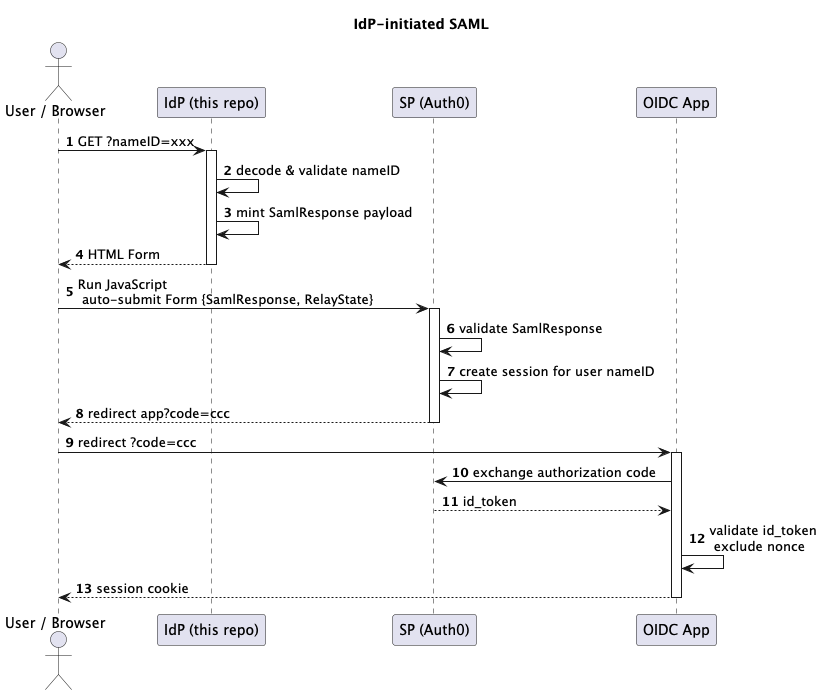

# mini-saml-idp-init-sso

A mini cloud hosted endpoint that issues IdP-initiated SAML token to create a session in your (Auth0) SP.

You can leverage this repo to establish session in the target Auth0 session. use cases are:

1. Introduce IdP-initiate like flows to your OAuth2/OIDC apps
2. Establish session (out of thin air) for example to achieve native to web SSO

## SAFE HARBOR
This is sample code to demonstrate a concept, it is not battle tested production code that can just be copy and pasted to your
production environment. Before releasing into production you should add the appropriate testing, error handling, and edge
case protections as per your use case.

## Supported Clouds
* AWS Lambda
* ~~Cloudflare workers~~
* ~~Deno Deploy~~

## Sequence
